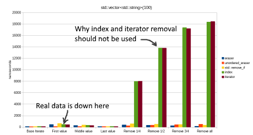
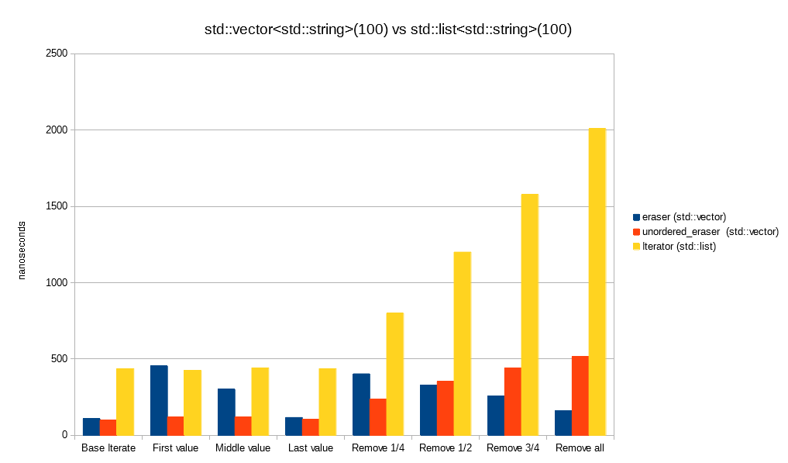

# Eraser Profile
This article discribes the performance differences of the eraser() and unordered_eraser() helper iterators.


## Introduction
When iterating in modern C++, you can use the range for syntax:
```c++
  for(auto& item : array)
```
  
But when you want to delete elements in the array while iterating, you either have to revert to the old fashioned index method:

```c++
  for(int i = 0; i < array.size(); )
  {
    if(array[i] == delete)
    {
      array.erase(array.begin() + i);
    }
    else
    {
      i++;// Increment i++ if not deleting 
    }
  }
```
  or use iterators
```c++  
  for(auto it = array.begin(); it != array.end();)
  {
    if(*it == delete)
    {
      it = array.erase(it);
    }
    else
    {
      it++;
    }
  }
```
  
However, these have performance issues if deleting more than one element as the container elements may be shuffled multiple times.
A slightly more modern approach is to use ```std::remove_if()``` with a lambda
```c++    
  array.erase(std::remove_if(array.begin(), array.end(), 
       [] (auto& item)
       {
         bool deleting = condition;
         return deleting;
       }
       ), array.end());
```
  
But this is a bit ugly to type, and may be error prone in ensuring the correct container is always used.

## eraser() and unordered_eraser()

Presented is a safe and performant way of removing elements while iterating on them.
Inspired by [Jonathan Blow's language feature on iterator removal](https://youtu.be/-UPFH0eWHEI?list=PLmV5I2fxaiCKfxMBrNsU1kgKJXD3PkyxO&t=2017) :
```c++   
  for(auto& item : iter::eraser(array))
  {
    if(*item == value) // Access item via deref
    {
      item.mark_for_erase();  // Item is marked for deletion, but is still valid until end of loop iteration
      item.index(); // Get the origional index of the item in the array 
    }
  }
```
If preserving order is not important:
```c++   
  for(auto& item : iter::unordered_eraser(array))
  {
    if(*item == value) // Access item via deref
    {
      item.mark_for_erase();  // Item is marked for deletion, but is still valid until end of loop iteration
    }
  }

```


## Performance

Below is presented performance graphs of the different ways of removing elements from an array as presented in the introduction. 
Source code for the tests can be found in Iterator_Profile.cpp.

All timings were done with VisualStudio 2017 RC (x64) on a Intel i7-4790 3.6GHz, 16GB ram @ 1866MHz, Windows 10.

The tests were done using std::vector data structure as linear data structures are most often used in performance code.

Note that the graphs have been cropped, as the performance of the index and iterator method was so bad for multiple removals.



Note that while eraser() and unordered_eraser() are generic, template specializations for could be written to optimize for other container types.

### std::vector < int >

")
")


### std::vector < std ::string >

")
")


## Compare with fast remove containers
It may be said that if fast removal is required, to use a container type that supports this. 
The removal via the iterator method should perform well with such container types.



As the above graph shows, using std ::vector with eraser/unordered_eraser is typically much faster that using a std ::list with iterator removal.

## Conclusion

As the above graphs show, eraser() and unordered_eraser() is faster than manual element removal - either by index or iterator.
Where elements are removed, eraser() and unordered_eraser() are faster or comparable to std::remove_if().

Deciding between eraser() and unordered_eraser() :

- If data needs to retain order - **eraser()**
- If data is a basic type (eg int,pointer) - **eraser()**
- If data is a complex type (expensive move/copy) and remove >50% of elements - **eraser()**
- If data is a complex type (expensive move/copy) and remove <50% of elements- **unordered_eraser()**


